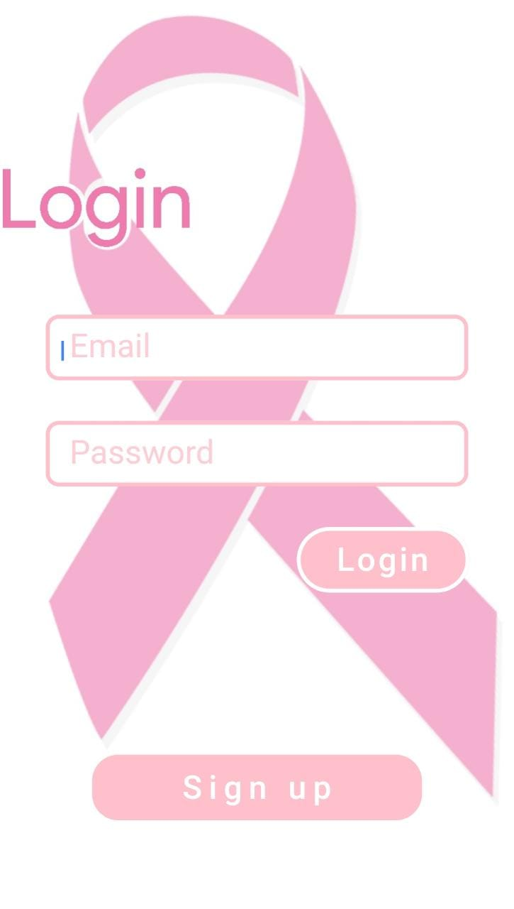
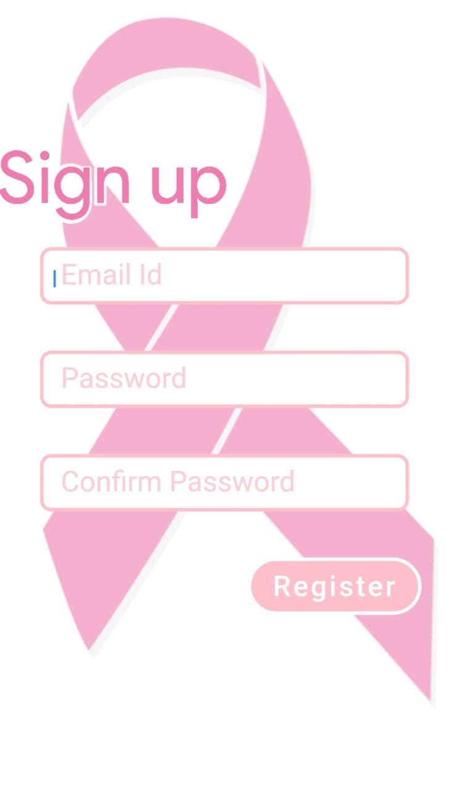
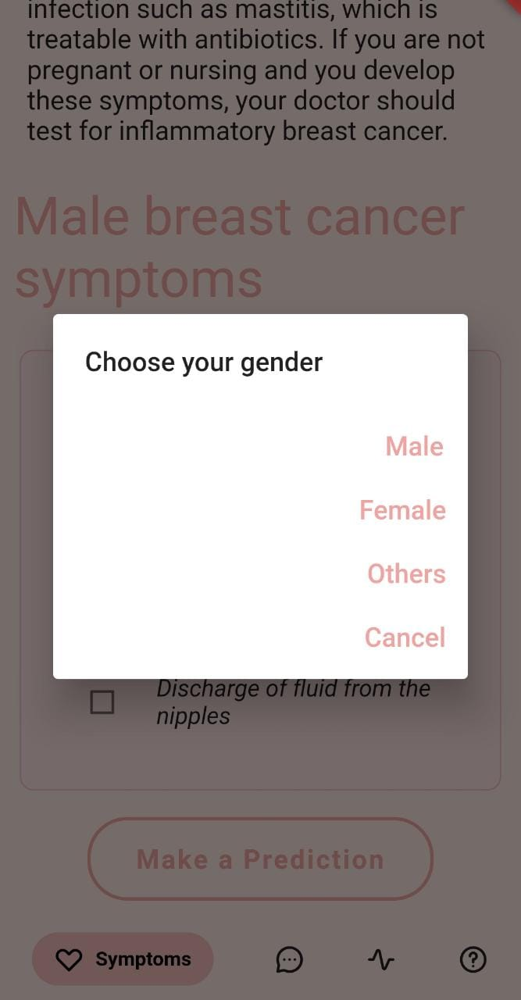
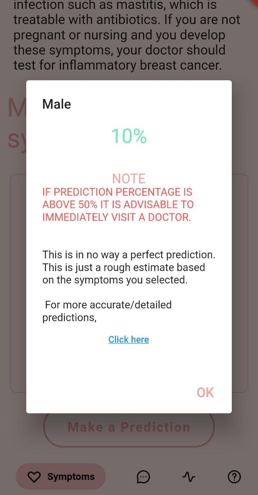
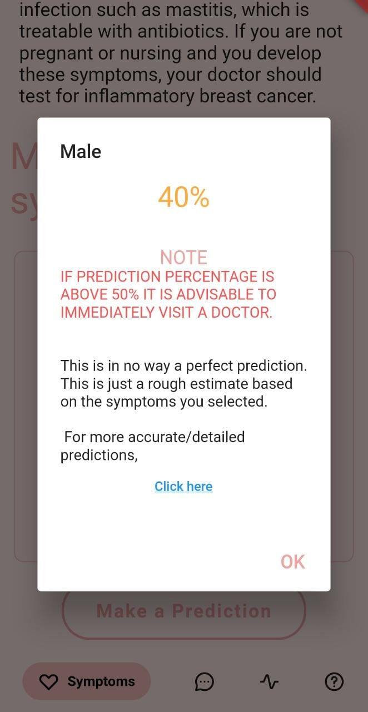
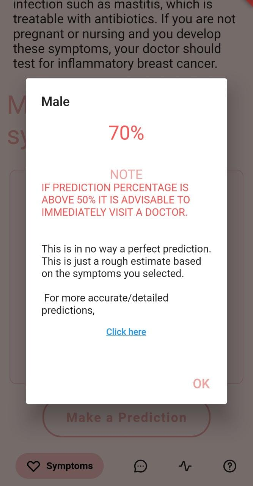
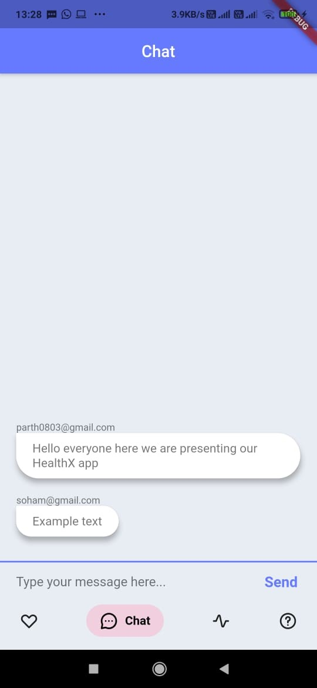
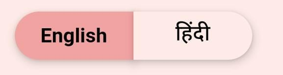
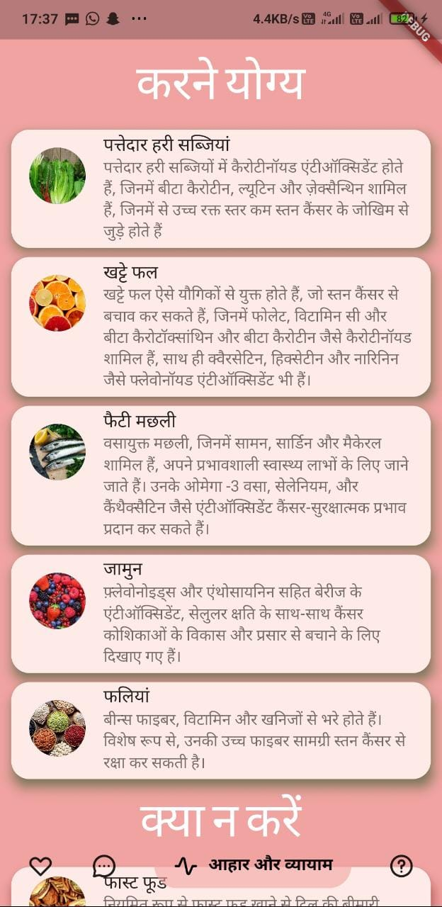
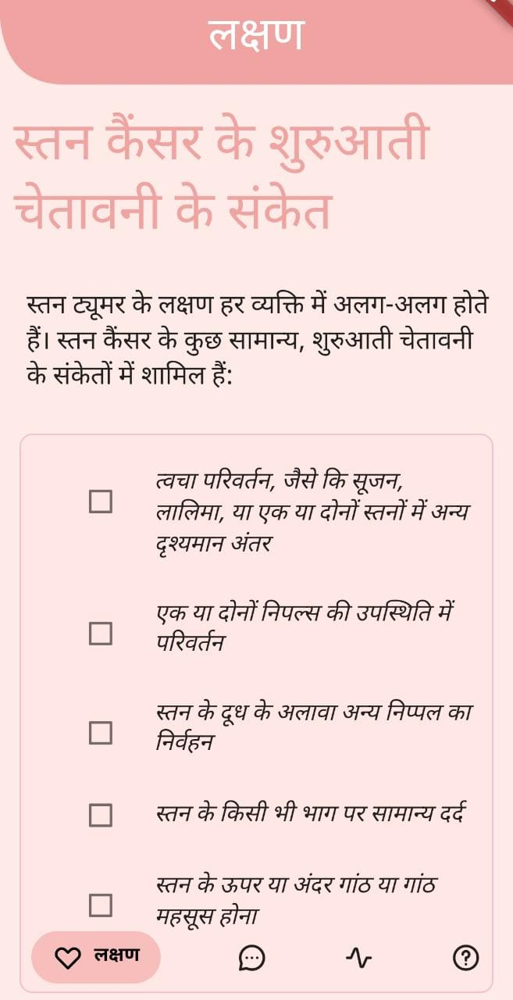

# HealthX

**(Click the image to go to the youtube video link of the App)**

**FLUTTER MOBILE APP APK -** [[click here]](https://github.com/ParthPandey2236/HealthX/raw/master/HealthX.apk)

In 2018, nearly 2 million new breast cancer cases were diagnosed.
It is estimated that 627,000 women died from breast cancer. 
That is approximately 15% of all cancer deaths among women
In order to improve breast cancer outcomes and survival, early detection is critical.

So we came up with an idea to make an application with a vision that people from all around the world will have the resources to consult a doctor. People from all over the world will get access to all information relating Breast Cancer.

Introducing **HealthX**

-	Helps to detect breast cancers symptoms at early stage.
-	A common chat forum to consult doctors and get more knowledge about medical issues from others all around the world.
- Information about all your essential diet and exercise to reduce the chance of having breast cancer.
- Choice of language for the user for dissolving the language barrier among people worldwide and having a wider reach.
- Uploading and storing of presciptions/X-rays in chat section to get advise from doctors worldwide.

## Features

1) Easy Sign up and Login with your email and password - powered by **Google Realtime Firebase**.

 

2) Once Signed in, there will be 4 options in the Bottom Navigation bar :- 
  
  - **Symptoms** - Takes in symptoms from the user that he/she is suffering from and predict roughly the chance of having breast cancer.
  
      
     
     **Steps :-**
     1) After checking the boxes of the problems you are suffering in Symptoms page , hit the **Make Prediction** Button at the bottom of the page 
     
          

      
     2) An alert box will open for you to choose gender :- 
     
           
     
     3) After choosing gender, a rough estimate will be shown in 3 different colours. If the precentage/estimate is in **GREEN** colour then the user is safe or having any other      medical problem other than Breast Cancer. If the percentage is shown in **Orange** colour, then the person is in gray area and must consult a doctor soon. If the percentage is shown in **RED** colour, then the person must immediately visit a doctor. Along with these a link is provided in the Dialogue box which calculates **Risk of Breast Cancer** with an algorithm published by the US Government itseld.
     
      

       
      
      
      

      
- **Chat Box** - It is an open forum for all people worldwide to connect with doctors and medical enthusiasts and get more knowledge/assisstance with their ongoing treatment or new treatment. Few features that we have in the chat box is :- 
   1) Uploading of pictures (i.e. medical presciption, X-rays etc from gallery or the inbuilt camera in your phone).
   2) Cropping the image to the size of your choice to send the exact image.
   3) Having it stored in the chat column for future reference.

          
         
- **Diet and Excercise** - It is an informative feed which has numerous details and information about good and bad food habits and a daily excercise routine which will highly reduce the risk of a person having Breast Cancer.

     
     
- **About** - It's a page having the goal/vision of the app **HealthX** and how it will help the community. This page also has a few features like - **Language Change** option and **Sign Out** Option.

    1. **Language Change** - It is a toggle switch in the top left corner of the About section in the App and it swiftly **changes the language of the entire app** to the language of your choice in mere mili-seconds. This feature was added solely to remove the **language barrier** among people in different community/regions and thereby fight **Breast cancer all united together**.
    
         
        
    After selecting **hindi** (Most common used language of India) conversions in all pages happen and even the chats changes to the local language for better understanding of the user :- 
    
    

       
      
      
       
      

      
   **Developers :-**
   
   
   
   We have made this Application with the vision of helping the community in any small way possible and just hope that the people suffering from Breast Cancer worldwide gets cured soon and lead a healthy life.
   
   Regards,
   
   **Team Ctrl-Alt-Elite**
